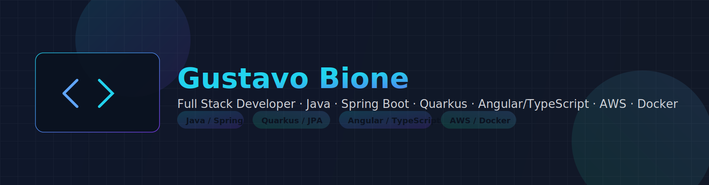

<!-- Banner -->

&nbsp; 

<h1 align="center">Hey there, I’m Gustavo Bione</h1>

&nbsp; <b>Full Stack Developer</b> · Java, Spring Boot, Quarkus, Angular/TypeScript · AWS · Docker

&nbsp; 

---

\## ✨ About Me

\- 🚀 Full Stack focado em apps seguras, performáticas e escaláveis.  

\- 🧩 Curto arquitetura limpa, testes, observabilidade e DevOps.  

\- 📚 Estudando \*\*Go\*\* \& \*\*Terraform\*\* pra reforçar fundamentos de plataforma.  

\- ☕ Café + código = produtividade.

---

\## 🧰 Main Stack

&nbsp; 

&nbsp; 

&nbsp; 

&nbsp; 

&nbsp; 

&nbsp; 

&nbsp; 

&nbsp; 

&nbsp; 

---

\## 📚 Currently Learning

&nbsp; 

&nbsp; 

&nbsp; 

---

\## 🚀 Featured Projects

&nbsp; <a href="https://github.com/bione-dev/User-Management-API">

&nbsp;   

&nbsp; </a>

&nbsp; <b>User Management API</b> — JWT, validações, OpenAPI, testes.  

&nbsp; Java, Spring Boot

&nbsp;   

&nbsp; <a href="https://github.com/bione-dev/Lista-Tarefas">

&nbsp;   

&nbsp; </a>

&nbsp; <b>Lista de Tarefas</b> — CRUD com validações e persistência.  

&nbsp; Java, Spring Boot

&nbsp;   

&nbsp; <a href="https://github.com/bione-dev/TimeZoneConverter">

&nbsp;   

&nbsp; </a>

&nbsp; <b>TimeZone Converter</b> — manipulação correta de datas/fusos.  

&nbsp; Java

---

\## 📊 GitHub Stats

&nbsp; 

&nbsp; 

---

\## 🤝 Let’s Connect

&nbsp; 

&nbsp; 

&nbsp; 

&nbsp; 

