<!-- Banner -->

  

<!-- Animated divider -->

  

  <b>Full Stack Developer</b> — Java · Spring Boot · Quarkus · Angular/TypeScript · AWS · Docker

<!-- Skills -->

  

---

## 🔥 Dashboard
<table align="center">
  <tr>
    <td>
      
    </td>
    <td>
      
    </td>
    <td>
      
    </td>
  </tr>
  <tr>
    <td colspan="3" align="center">
      
       📌 Updated daily via GitHub Actions
    </td>
  </tr>
</table>

---

## 💡 About Me

I'm a junior full stack developer passionate about building **practical and functional applications**.  
I enjoy learning new technologies, improving my coding skills, and following good development practices.

- 🚀 **Experience with:** Java, Spring Boot, Quarkus, and basic distributed systems  
- 🛠️ **Familiar with:** AWS, Docker, CI/CD concepts  
- 📊 **Interested in:** Observability, testing, and clean code  
- 🌱 **Currently learning:** AWS ☁️ and Security 🔐 to strengthen my skills in cloud computing and application protection  
- ☕ Coffee lover and always curious about how things work

  

  

  

  

<!-- Section divider image -->

  

## 🤝 Connect with me

  <!-- LinkedIn -->
  
  <!-- Email -->
  

  

<!-- gradient footer -->

  <svg width="100%" height="100" viewBox="0 0 100 100" preserveAspectRatio="none">
    <defs>
      <linearGradient id="grad1" x1="0%" y1="0%" x2="100%" y2="0%">
        <stop offset="0%" style="stop-color:#7C3AED;stop-opacity:1" />
        <stop offset="100%" style="stop-color:#22D3EE;stop-opacity:1" />
      </linearGradient>
    </defs>
    <path d="M0,0 L100,0 L100,100 L0,70 Z" fill="url(#grad1)" />
  </svg>

